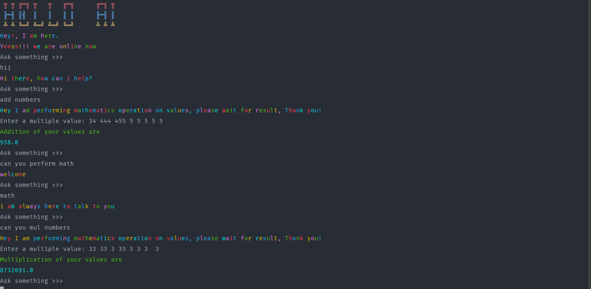

<h1 style="background: linear-gradient(to right, #ee0979, #ff6a00); text-align:center">HELLO AI</h1>
 
<h3>I have developed AI based chat bot perform simple math operation on user request</h3>

 
    For developing the AI based chatbot i have used tensorflow and NLP in python.
    It is a simple console application, but interesting is bot print out in colorful text.

